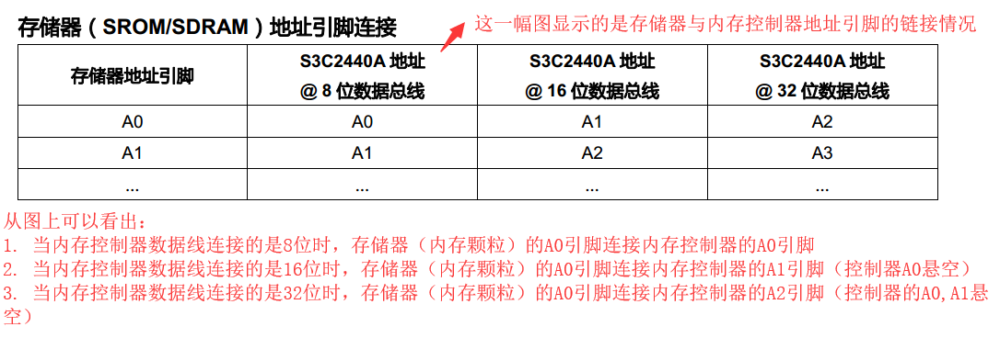
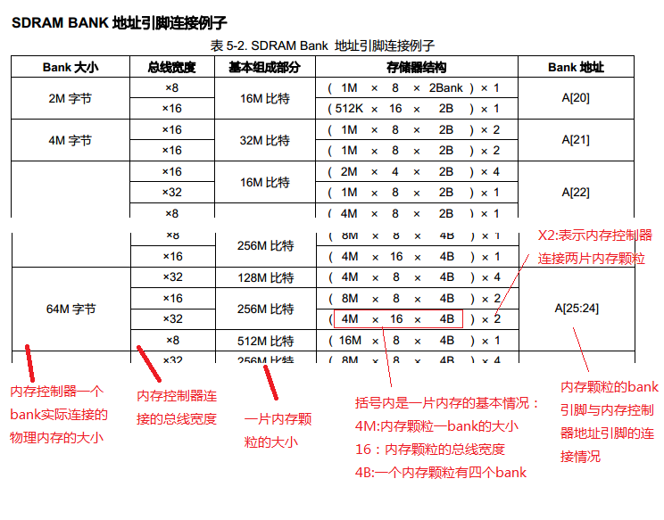
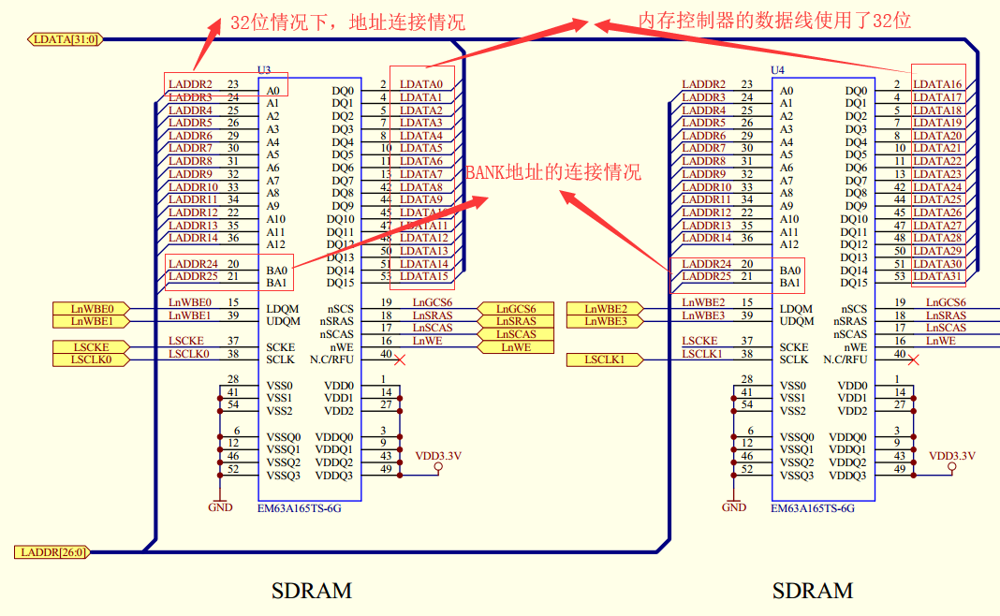

# 内存控制器
<div>
CPU在访问内存地址空间的时候，先把访问请求发给内存控制器，至于这个地址属于哪个外设，CPU不去关心，CPU发出请求后就把后续的事情交给内存控制器来处理了，然后CPU就是等着内存控制器的回复即可。
</div>
</br>

```sh
内存控制器的数据线宽度不会影响CPU的行为，但是会影响内存控制器地址线与内存颗粒的连线情况情况：
1. 当内存控制器的位宽是32位时：
  CPU可以发送任意地址（比如 0x0, 0x1, 0x2, 0x3）
  内存控制器发送的有效地址是4字节对齐（比如 0x0, 0x4, 0x8），（32位时，内存控制器的地址总线的A0,A1不外接内存芯片引脚，从程序猿的角度看，地址是四字节对齐）

  数据访问：
    CPU访问指定内存（0x5）:CPU给内存控制器发送0x5,内存控制器得到0x5后将这个地址做4字节对齐处理（32位时，内存控制器的地址总线的A0,A1不外接内存芯片），然后将这个通过地址总线发送出去，等到内存控制器获取到这个4字节大小的数据后，在将数据按照CPU的需求进行处理，将处理后的结果发送给CPU。

2. 当内存控制器的位宽是16位时：
情况与32位相同，不同的是（16位时，内存控制器的地址总线的A0不外接内存芯片）

3. 当内存控制器的位宽是16位时：
情况与32位相同，不同的是（8位时，内存控制器的地址总线的A0也要外接内存芯片）
```

<div>内存颗粒与内存控制器地址引脚连接情况</div>



<div>内存颗粒bank引脚与内存控制器地址引脚连接情况</div>



<div>芯片连接原理图</div>


