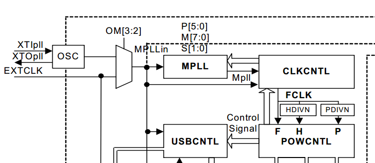
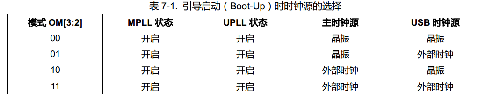
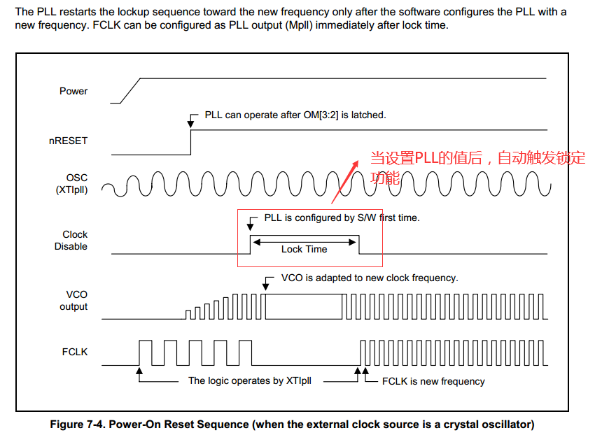
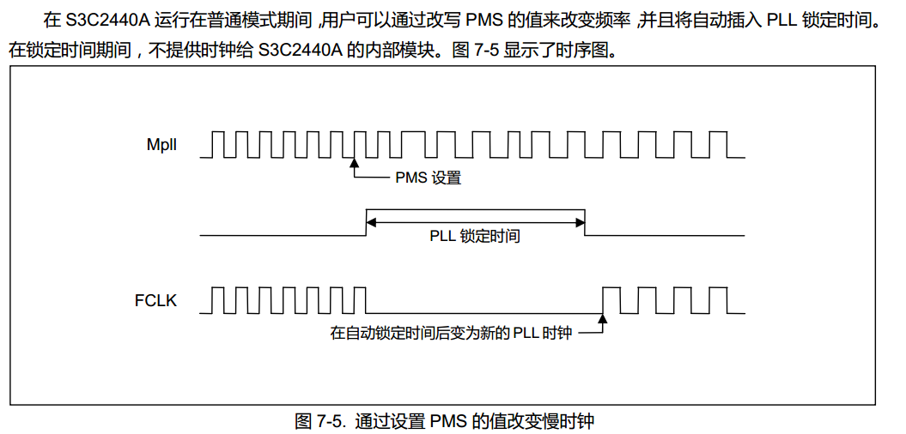
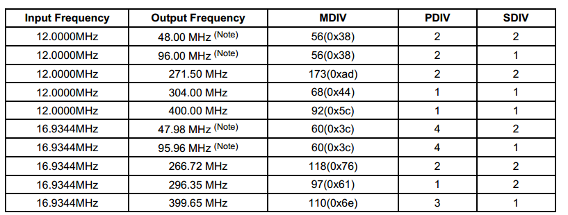
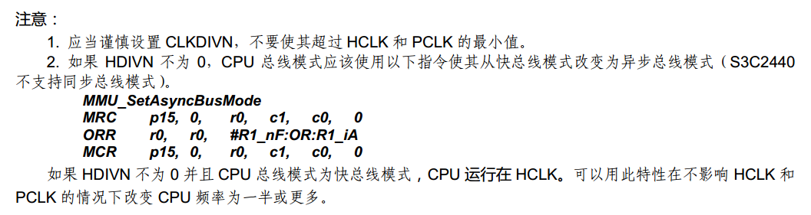

# 时钟设置

## 1. 硬件介绍
```sh
  本文主要介绍时钟的配置使用（版本忽略upll的使用）
```



```sh
  从上面的图中可以看出时钟关系如下：
  1. MPLL通过OM[3:2]引脚选择系统时钟源（外设时钟源或者外部晶振）
  2. FCLK来自MPLL的配置输出
  3. FCLK经过HDIVN得到HCLK
  4. FCLK经过PDIVN得到PCLK
  5. OM[3:2]的值通过板子的电路原理图获得
```





```
  上面的图介绍SOC上电复位的情况，当我们使用软件设置MPLLCON寄存器的值时，
  CPU自动锁定，锁定时间是LOCKTIME的值。
```


```
  PMS的常用匹配值
```

## 2. 相关寄存器
```
  LOCKTIME:设置CPU锁定时间
  CLKDIVN：HCLK与PCLK的分频值
  CAMDIVN：第9位或者第8位决定FCLK与HCLK的比例关系
  MPLLCON：设置MPLL的配置参数
```

## 3. 配置clk

```
1. 配置需求：
  fclk  hclk  pclk
  400M  100M  50M

2. 设置代码

void clock_set()
{
	LOCKTIME = 0xffffffff;                           //设置锁定时间
	CLKDIVN = (CLKDIVN&(~(0x7))) | (2 << 1) | 1;     //设置H\P的分频值
	//CAMDIVN &= ~(1 << 9);                          //设置F\H的比例关系
	asm(                                             //设置CPU支持异步模式（否则cpu将使用HCLK的频率工作）
		"mrc p15,0,r0,c1,c0,0 \n\t"
		"orr r0,r0,#0xc0000000 \n\t"  //R1_nF:OR:R1_iA
		"mcr p15,0,r0,c1,c0,0  \n\t"
	);

	MPLLCON = (92<<12) | (1<<4) |(1<<0);           //设置MPLL  
	/* 一旦设置PLL, 就会锁定lock time直到PLL输出稳定
	 * 然后CPU工作于新的频率FCLK
	 */

}
```
