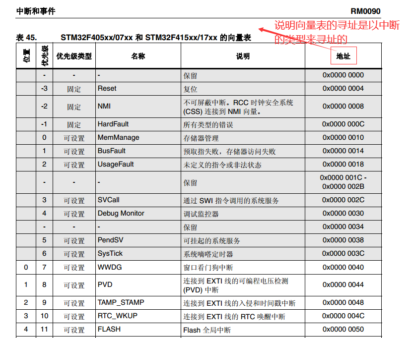
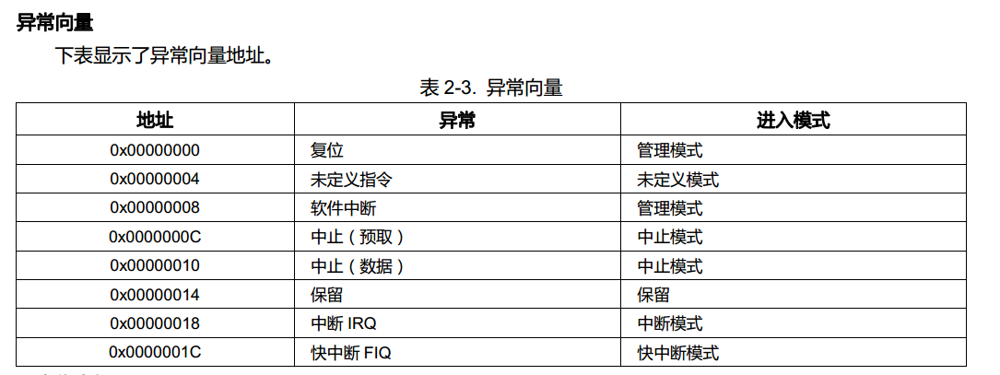

# 异常
[参考地址](https://blog.csdn.net/qq_34127958/article/details/72791382)
## 1. 三级流水线
```
流水线使用三个阶段，因此指令分为三个阶段执行：1.取指（从存储器装载一条指令）；2.译码（识别将要被执行的指令）；3.执行（处理指令并将结果写回寄存器）。

R15（PC）总是指向“正在取指”的指令，而不是指向“正在执行”的指令或正在“译码”的指令。

指令执行时， PC的值 = 当前正在执行指令在内存中的地址 + 8


1. 当前执行的指令的地址是PC-8
2. 当前执行指令的下一条指令的地址应该是PC-4
3. 所以在异常产生时处理器会将PC-4的值保存到对应模式的LR寄存器中
```


* 异常返回处理
异常处理FIQ与RIQ异常：

FIQ与RIQ异常返回处理是一样的，当处理器执行完当前指令后才去CPSR查询中断且查看是否允许中断，如果处理器产生了中断，这时PC的值已经更新，即PC指向了当前指令后第三条指令的位置(被中断指令地址加12)，产生FIQ与RIQ异常后处理器将PC-4的值保存到了对应模式下的LR，而它指向的是当前被中断指令的后面的第二条指令，因此在返回时我们需要人为的将LR中保存的值自减4以得到正确的返回地址。

预取指中止异常：

在指令预取时如果地址是非法的，该指令就被标记为有问题的指令，流水线上该指令之前的指令继续执行，当执行被标记为有问题的指令的时候，处理器就会产生异常。产生该异常最终返回时需要返回到被标记的指令处重新读取并执行该指令，因此异常返回时需要返回到该指令处而不是该指令的下一条指令。所以在中断返回时我们需要人为的对LR中保存的值自减4。

指令未定义异常：

指令未定义异常由当前正在执行的指令产生，即产生异常时PC的值还没有更新，PC的值指向当前指令后面第二条指令，产生异常后LR中保存的指令是当前指令的下一条指令的地址，所以异常返回时直接把LR的值给PC即可不许人为的去修正返回地址。

软中断异常：

软中断异常与指令未定义异常一样，也是当前指令在执行过程中就产生了异常，所以LR中保存的返回地址是当前软中断指令的下一条指令的地址，不需要人为的去修正，返回时直接将LR的值赋给PC即可。

数据中止异常：

产生该异常的时候程序要返回到有问题的指令处重新访问该数据，因此应该返回到产生异常的指令处而不是产生异常指令的下一条指令处。当异常产生时PC的值已经更新，所以PC指向的是异常产生指令的后面的第三条指令，而LR中保存的是PC-4的值即异常产生指令的后面的第二条指令的地址。所以在返回时我们需人为的对LR中的值进行自减8的处理。以保证异常正确的返回。

上述每一种异常发生时，返回地址都要根据具体的异常类型进行重新修正。  

## 向量表
* 1. 对于M系列的芯片来说，向量表指的是中断向量表
* 2. 对于A系列的芯片来说，向量表指的是异常向量表

STM32f4xx中断向量表（中断发生时PC的自动赋值表）


A系列芯片异常向量表（异常发生时PC的自动赋值表）


## 代码
```
_start:

	b reset          /* vector 0 : reset */
	ldr pc, und_addr /* vector 4 : und */
	ldr pc, swi_addr /* vector 8 : swi */

  为什么 reset使用b指令，而向量表的其他却可以使用ldr指令，因为经过reset后，代码已经重定向了，所以可以决定地址跳转。
```
