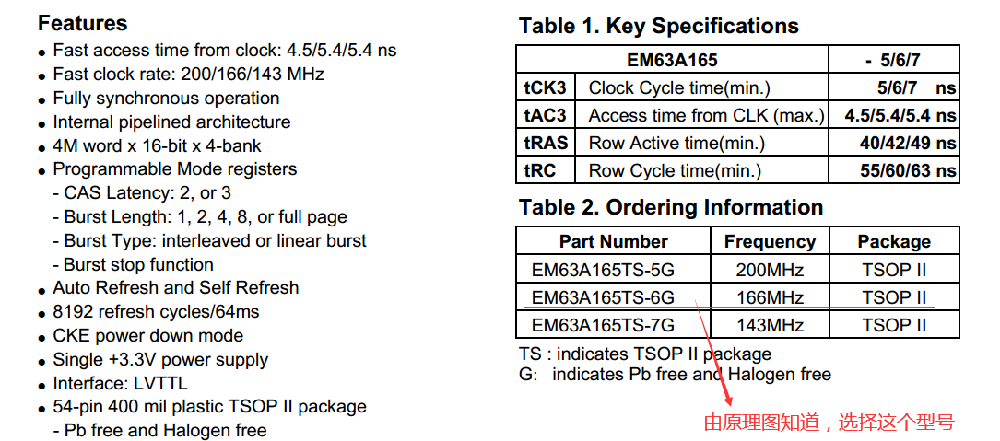
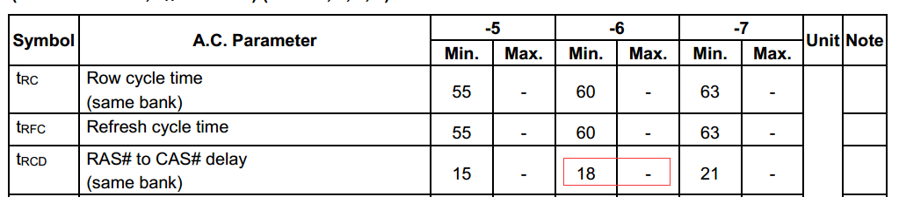
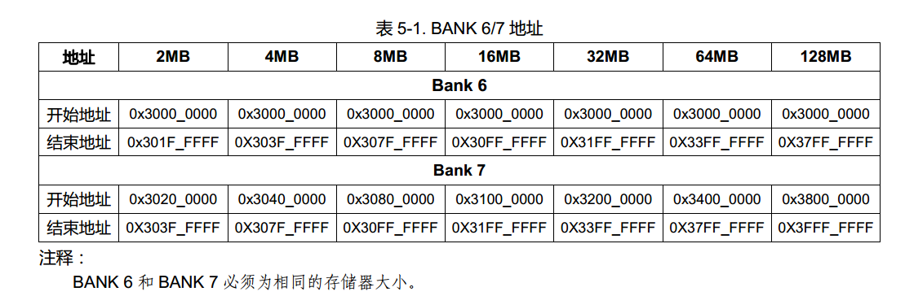
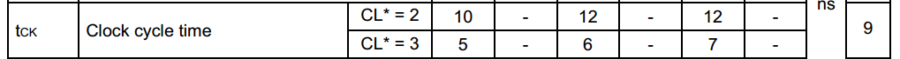
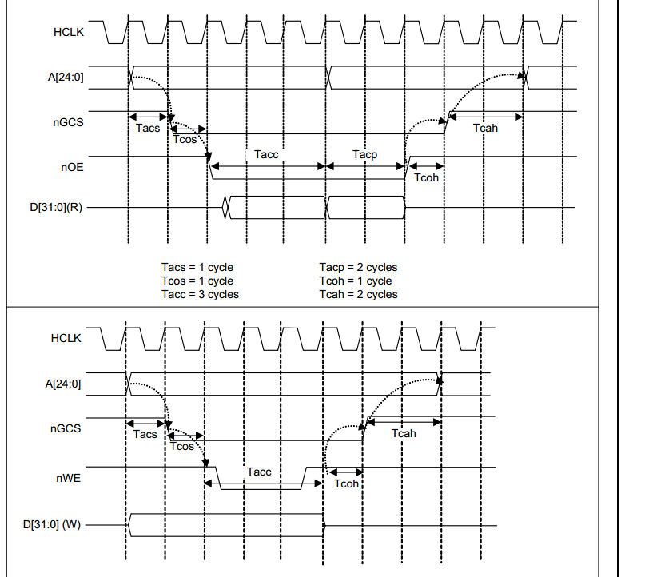
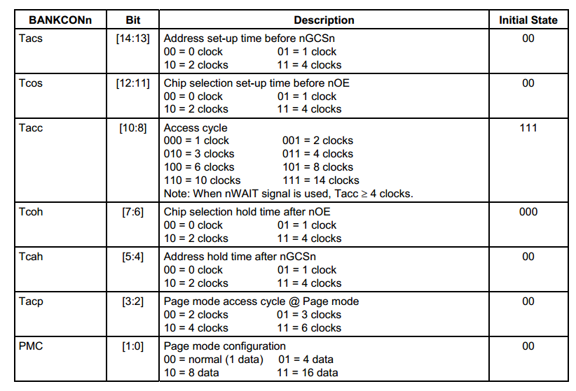
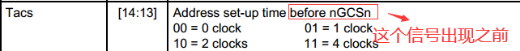
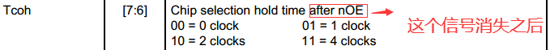
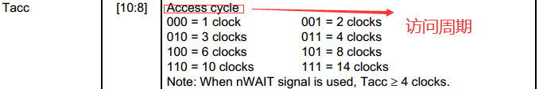

# SDRAM 时序分析及代码实现

## 1. 时序分析

### 1.1 由SDRAM原理图可知
```
  1. SDRAM挂载在soc内存控制的bank6上面
  2. bank6使用32位数据宽度
  3. SDRAM内部的bank地址占用两个地址信号线
  4. SDRAM芯片类型：EM63A165TS-6G
```

### 1.2 SOC的时序原理图以及寄存器
```
在2440中，SDRAM只能在bank6和bank7中，相关参数寄存器如下：
BWSCON     ：总线宽度和等待控制寄存器
BANKCON6   ：2440中bank6时序参数配置寄存
BANKCON7   ：2440中bank7时序参数配置寄存

REFRESH    ：SDRAM充电配置参数
BANKSIZE   ：2440的bank的大小

MRSRB6     ：bank6（SDRAM）访问模式配置寄存器
MRSRB7     : bank7（SDRAM）访问模式配置寄存器
```

### 1.3 代码配置

图1 内存颗粒芯片数据简介



图2 RCD时间大小


图3 bank6/7的起始地址与结束地址


图4 设置CLK的时间最小周期值


```
  从上述图片中可知：
  1. 此内存颗粒的大小是：4bank * 4M * 16位宽
  2. cas latecy：2 or 3

```

```
SDRAM芯片类型：EM63A165TS-6G
void sdram_init(void)
{
    BWSCON = 0x22000000;  //设置bank6，bank7的位宽是32位（由2个16位组成）

    BANKCON6 = 0x18001;   
    /*
      SCAN:列地址信号线数：9位宽
      Trcd：行地址到列地址之间的延迟周期数：搜索内存芯片可知（上图2） 最小是18ns，则可以配置为2个时钟周期即可
      MT：  内存类型：SDRAM
    */
    BANKCON7 = 0x18001; //bank7的配置，和bank6的意思一样


    REFRESH  = 0x8404f5;
    /*
      REFEN:使能刷新功能
      TREFMD：不知道的选择默认值即可
      Trp：SDRAM RAS 预充电时间（在内存芯片中搜索Trp得知是18ns，所以两个时钟周期即可）
      Tsrc：SDRAM 半行周期时间（Tsrc = Trc -Trp  = 60 - 18 = 42ns -> 5个周期 ）
      Refresh Counter:SDRAM 刷新计数值 (由图1可知，此sdram的刷新数是：64ms->8192周期,所以刷新周期值 = 64/8192 = 0.0078125ms -> 约等于7.8us)
        所以根据公式可知刷新计数值 = 1269；

    */

    BANKSIZE = 0xb1;
    /*
      BURST_EN : 使能突发操作 （由图1可知，此SDRAM芯片颗粒支持突发访问模式）
      SCKE_EN  ：使能掉电模式（SOC的功能）
      SCLK_EN  ：是否降功耗（SDRAM时钟信号使能信号）   
      BK76MAP  ： bank6/7的映射大小 ，在bank6/7中，SDRAM的大小决定了bank6/7的起始映射地址：
                  由图1可知，一片内存颗粒的大小是：4*4*16b = 4*4*2B = 32MB,在bank6中有两片内存颗粒，所以bank6的总SDRAM的大小是64MB。
    */

    MRSRB6   = 0x30;
    /*
      sdram的突发设置
        突发设置保持SOC中默认值即可。
        CL：CAS 等待时间（latency），由图4可知，CL的值应该选择3，
          因为HCLK是100M,也就是意味着内存芯片的CLK等于10ns。选择CL=3，符合这个要求的。

    */
    MRSRB7   = 0x30;
}
```

### 1.4 代码测试
```
int sdram_test(void)
{
volatile unsigned char *p = (volatile unsigned char *)0x30000000;
//由图3可知，因为bank6的起始地址是0x30000000;
int i;
// write sdram
for (i = 0; i < 1000; i++)
  p[i] = 0x55;

// read sdram
for (i = 0; i < 1000; i++)
  if (p[i] != 0x55)
    return -1;
return 0;
}

//通过写入与读出，如果内容一致，则说明SDRAM初始化没有问题。
```


### 1.5 时序简介



```
从上面两幅图可以看出：
  before xxx:
    表示的是在xxx信号之前
  after xxx:
    表示的是在xxx信号消失之后
```




```
但是实际需要关注的是访问周期：原则上只要满足了内存颗粒访问周期的最大时间，也就满足了基本的时序要求。所以对于其他的时序要求可以不做细节处理，采用默认值即可。
```

