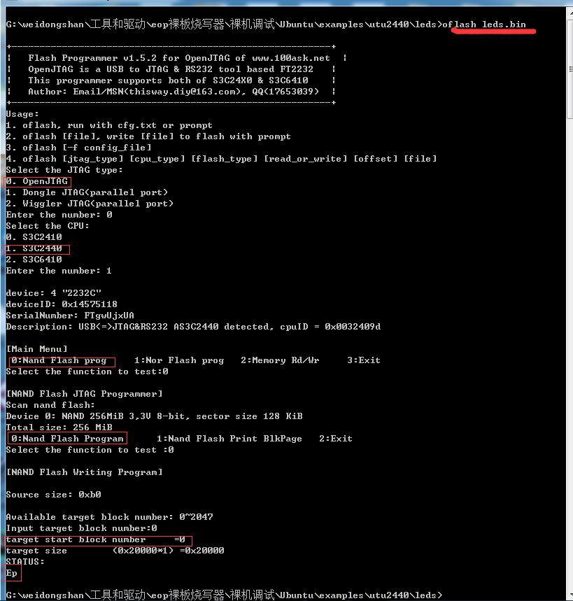

# win7-openJTAG搭建
## [参考资料](../src)
## 01 目录
* [01 安装JTAG驱动](#jump1)
* [02 OpenOCD](#jump2)
* [03 使用JTAG下载裸板程序](#jump3)
* [04 使用Putty和OpenOCD进行裸板调试](#jump4)


## <span id="jump1">01 安装JTAG驱动
* 01 [下载驱动包](链接：https://pan.baidu.com/s/1QUnOoEPqqsxc-hROu-CBkg)
提取码：(tjjk)
* 02 在win7上面解压“工具和驱动.zip”


* 03 将OPENJTAG连接到PC机，安装驱动程序


## <span id="jump2">02 OpenOCD
* 安装调试工具（OpenOCD）
```sh
安装此调试工具时，先将JTAG插入到PC机，然后默认安装即可。
```


## <span id="jump3">03 使用JTAG下载裸板程序
* 01. 将oflash工具及其依赖库的路径添加到系统的PATH变量中

```sh
1. 解压oflash_1.5.6.rar
2. 将oflash.exe拷贝到eop裸板烧写器\驱动\OpenJTAG\i386目录中
3. 将‘G:\weidongshan\工具和驱动\eop裸板烧写器\驱动\OpenJTAG\i386’添加到PATH环境变量中
4. 打开cmd，输入'oflash',查看命令信息
```


* 02. 通过oflash将裸板程序下载到开发板中

```sh
1. 使用JTAG连接开发板和PC机
2. 给开发板上电
3. 按照下面的两幅图进行烧写
4. 烧写完成后重启开发板，使程序运行
```





## <span id="jump4">04 使用Putty和OpenOCD进行裸板调试
[参考资料](../src/Eclipse,OpenOCD,OpenJTAGv3.1嵌入式开发教程版本5.pdf)
```sh
1. 点击我的电脑打开‘openocd’
2. 按照下图进行配置连接到开发板
3. 使用putty连接openocd进行调试
```


