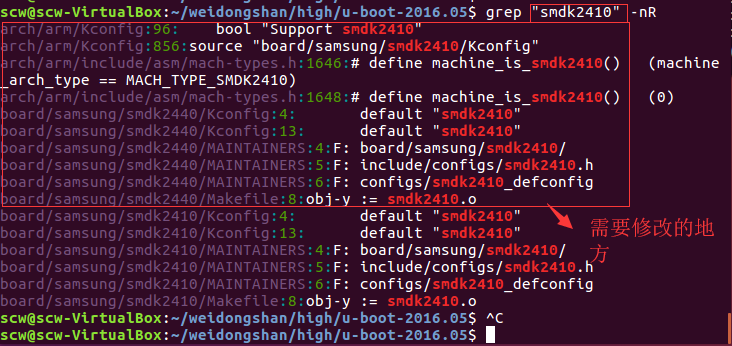
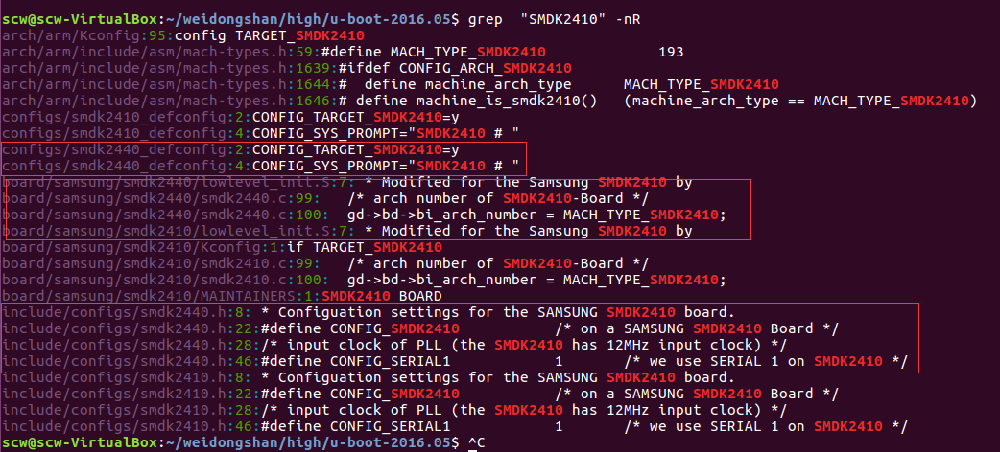

# uboot2016 建立单板
###  建立单板
```sh
1. 下载源代码：
wget ftp://ftp.denx.de/pub/u-boot/u-boot-2016.05.tar.bz2

2. 解压：
tar xvf u-boot-2016.05.tar.bz2

3. 建立新单板的相关文件
cd u-boot-2016.05/board/samsung/
  cp smdk2410 smdk2440 -rf
cd xxx/u-boot-2016.05
  cp include/configs/smdk2410.h  include/configs/smdk2440.h
  cp configs/smdk2410_defconfig  configs/smdk2440_defconfig

4. 修改相关参数
  因为我们的新板（2440）是以2410为模板进行建立的，所以我们在uboot的根目录下搜索2410的相关信息，然后将其改成2440即可。

  cd xxx/u-boot-2016.05

  因为linux区分大小写，所以我们也要区分大小写进行修改：
4.1 修改小写
  grep "smdk2410" -nR
scw@scw-VirtualBox:~/weidongshan/high/u-boot-2016.05$ grep "smdk2410" -nR
arch/arm/Kconfig:96:	bool "Support smdk2410"
arch/arm/Kconfig:856:source "board/samsung/smdk2410/Kconfig"
arch/arm/include/asm/mach-types.h:1646:# define machine_is_smdk2410()	(machine_arch_type == MACH_TYPE_SMDK2410)
arch/arm/include/asm/mach-types.h:1648:# define machine_is_smdk2410()	(0)
board/samsung/smdk2440/Kconfig:4:	default "smdk2410"
board/samsung/smdk2440/Kconfig:13:	default "smdk2410"
board/samsung/smdk2440/MAINTAINERS:4:F:	board/samsung/smdk2410/
board/samsung/smdk2440/MAINTAINERS:5:F:	include/configs/smdk2410.h
board/samsung/smdk2440/MAINTAINERS:6:F:	configs/smdk2410_defconfig
board/samsung/smdk2440/Makefile:8:obj-y	:= smdk2410.o (若是需要修改此处，请将smdk2410.c改为smdk2440.c)
board/samsung/smdk2410/Kconfig:4:	default "smdk2410"
board/samsung/smdk2410/Kconfig:13:	default "smdk2410"
board/samsung/smdk2410/MAINTAINERS:4:F:	board/samsung/smdk2410/
board/samsung/smdk2410/MAINTAINERS:5:F:	include/configs/smdk2410.h
board/samsung/smdk2410/MAINTAINERS:6:F:	configs/smdk2410_defconfig
board/samsung/smdk2410/Makefile:8:obj-y	:= smdk2410.o

4.2 修改大写
grep  "SMDK2410" -nR

scw@scw-VirtualBox:~/weidongshan/high/u-boot-2016.05$ grep  "SMDK2410" -nR
arch/arm/Kconfig:95:config TARGET_SMDK2410
arch/arm/include/asm/mach-types.h:59:#define MACH_TYPE_SMDK2410             193
arch/arm/include/asm/mach-types.h:1639:#ifdef CONFIG_ARCH_SMDK2410
arch/arm/include/asm/mach-types.h:1644:#  define machine_arch_type	MACH_TYPE_SMDK2410
arch/arm/include/asm/mach-types.h:1646:# define machine_is_smdk2410()	(machine_arch_type == MACH_TYPE_SMDK2410)
configs/smdk2410_defconfig:2:CONFIG_TARGET_SMDK2410=y
configs/smdk2410_defconfig:4:CONFIG_SYS_PROMPT="SMDK2410 # "
configs/smdk2440_defconfig:2:CONFIG_TARGET_SMDK2410=y
configs/smdk2440_defconfig:4:CONFIG_SYS_PROMPT="SMDK2410 # "
board/samsung/smdk2440/lowlevel_init.S:7: * Modified for the Samsung SMDK2410 by
board/samsung/smdk2440/smdk2440.c:99:	/* arch number of SMDK2410-Board */
board/samsung/smdk2440/smdk2440.c:100:	gd->bd->bi_arch_number = MACH_TYPE_SMDK2410;
board/samsung/smdk2410/lowlevel_init.S:7: * Modified for the Samsung SMDK2410 by
board/samsung/smdk2410/Kconfig:1:if TARGET_SMDK2410
board/samsung/smdk2410/smdk2410.c:99:	/* arch number of SMDK2410-Board */
board/samsung/smdk2410/smdk2410.c:100:	gd->bd->bi_arch_number = MACH_TYPE_SMDK2410;
board/samsung/smdk2410/MAINTAINERS:1:SMDK2410 BOARD
include/configs/smdk2440.h:8: * Configuation settings for the SAMSUNG SMDK2410 board.
include/configs/smdk2440.h:22:#define CONFIG_SMDK2410		/* on a SAMSUNG SMDK2410 Board */
include/configs/smdk2440.h:28:/* input clock of PLL (the SMDK2410 has 12MHz input clock) */
include/configs/smdk2440.h:46:#define CONFIG_SERIAL1		1	/* we use SERIAL 1 on SMDK2410 */
include/configs/smdk2410.h:8: * Configuation settings for the SAMSUNG SMDK2410 board.
include/configs/smdk2410.h:22:#define CONFIG_SMDK2410		/* on a SAMSUNG SMDK2410 Board */
include/configs/smdk2410.h:28:/* input clock of PLL (the SMDK2410 has 12MHz input clock) */
include/configs/smdk2410.h:46:#define CONFIG_SERIAL1		1	/* we use SERIAL 1 on SMDK2410 */
scw@scw-VirtualBox:~/weidongshan/high/u-boot-2016.05$ ^C


5. 编译
make smdk2440_config
make -j10
```

<div>小写</div>



<div>大写</div>


