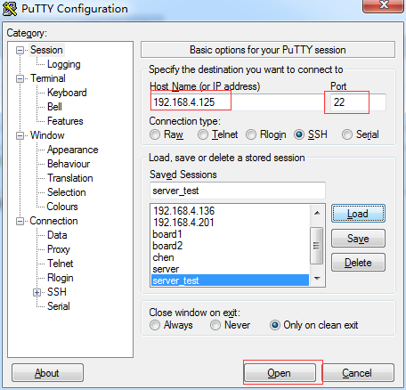

# Ubuntu常用服务器搭建
### [1. 创建linux虚拟机](http://note.youdao.com/noteshare?id=7d44f6d199affe93d2919ae6db8e35cb)

### 2. 搭建系统服务
* [01 opensshd服务的搭建](#jump1)
* [02 vsftpd服务的搭建](#jump2)
* [03 nfs服务搭建](#jump3)

###  <span id="jump1">01 opensshd服务的搭建
* [1. 参考地址](http://www.cnblogs.com/chenfulin5/p/8621612.html)
* [2. 安装](#)
```sh
sudo  apt-get install openssh-server
sudo /etc/init.d/networking restart
```
&nbsp;&nbsp;&nbsp;&nbsp;&nbsp;&nbsp;&nbsp;
* [3. 使用putty登录](#)



###  <span id="jump2">02 vsftpd服务的搭建
* [1. 参考地址](http://www.cnblogs.com/chenfulin5/p/8621612.html)
* [2. 安装](#)
```sh
sudo apt-get install vsftpd  vim
```
* [3. 配置](#)
<div>sudo vim /etc/vsftpd.conf</div>

```sh
1. 使用IPV4
2. 把 write_enable 和  local_umask 打开
```

* [4. 重启](#)
```sh
sudo service  vsftpd restart
```

###  <span id="jump3">03 nfs服务搭建
* [1. 参考地址](#)
* [2. 安装](#)
```sh
sudo apt-get install nfs-kernel-server
```
* [3. 配置](#)
```sh
1.修改配置文件
  sudo vi /etc/exports
			在文件最后添加如下内容
			/source/rootfs  *(rw,sync,no_subtree_check,no_root_squash)

			注1：/source/rootfs  要共享的目录
			注2：*  所有主机都可以共享该目录
			注3：(rw,sync,no_subtree_check,no_root_squash)  访问该目录的主机拥有的权限
				# rw                具有读写权限
				# sync              文件同步写入到内存和硬盘
				# no_subtree_check  不检查子目录权限  子目录与顶层目录具有相同的权限
				# no_root_squash    如果客户端是root的话，那么他对这个共享目录具有root的权限	```

2.创建共享目录
  sudo mkdir -p /source/rootfs
  sudo chmod 777 /source

* [4. 重启](#)
```sh
sudo service nfs-kernel-server restart
```

* [5. 客户端挂载](#)
```sh
1.把你想拷贝到开发板上的文件都复制到刚才设置的目录里，例如拷贝到 /source/rootfs，然后在开发板上执行挂载命令
    mount -t nfs -o nolock,vers=2 192.168.4.199:/source/rootfs  /mnt
    解释一下：
      mount :挂载命令
      nfs :使用的协议
      nolock :不阻塞
      vers : 使用的NFS版本号
      IP : NFS服务器的IP（NFS服务器运行在哪个系统上，就是哪个系统的IP）
      /work/nfs: 要挂载的目录（Ubuntu的目录）
      /mnt : 要挂载到的目录（开发板上的目录，注意挂载成功后，/mnt下原有数据将会被隐藏，无法找到）
  ```
